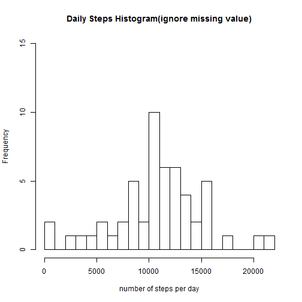
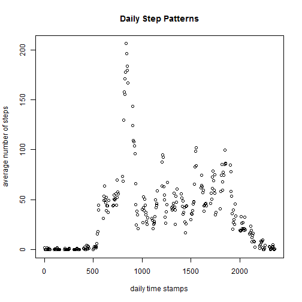
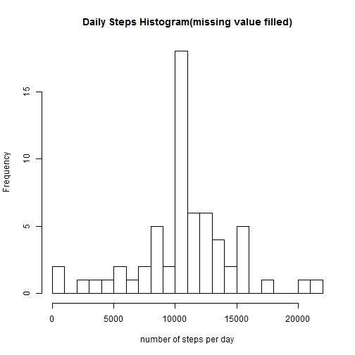
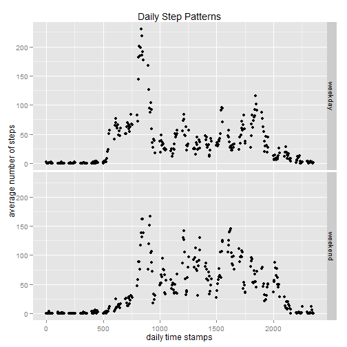

Daily Foot steps Analysis
==========================================================
Load the raw data, the necessary libraries for processing data, and convert data into data table format.


```r
setwd("C:/Users/nzhong/Documents/rstudio/CourseraDataScienceTrack/repreducible Research/")
data<-read.csv("activity.csv")
library(data.table)
library(ggplot2)
options(scipen = 999)
no_na_data<-as.data.table(data[complete.cases(data),])
```

## Part I  Ignore Missing Records##

### 1.1 Analysis of number of steps taken per day

```r
daily_steps<-no_na_data[,sum(steps),by=list(date)]$V1
hist(daily_steps,breaks=20,xlab="number of steps per day",main="Daily Steps Histogram(ignore missing value)",ylim=c(0,15))
```

 
  
the mean and median total number of steps taken per day are **10766.1886792** and **10765** separately

### 1.2 Analysis of average daily activity pattern

```r
daily_patterns<-no_na_data[,mean(steps),by=list(interval)]
setnames(daily_patterns,c("interval","AvgSteps"))
max_steps_interval<-daily_patterns[order(-AvgSteps)][1,]
plot(daily_patterns,xlab="daily time stamps",ylab="average number of steps",main="Daily Step Patterns")
```

 
  
the maximum number of steps, on average across all the days in the dataset, is 206.1698113    
and it occurred on the interval 835


# Part II Imputing missing values

Calculate the number of missing records

```r
num_missing<-dim(data)[1]-dim(no_na_data)[1]
```
There are altogether **2304** missing records out of **17568** total records

All the missing step values are replaced by the mean number of steps on average across all the days in the dataset with the same interval. 


### 2.1 Draw the histogram of number of steps per day again with this new dataset, we get
 
  
the mean and median total number of steps taken per day are **10766.1886792** and **10766.1886792** separately  
It's almost the same as the ignoring NA case.  
According to the plot, the variations of the frequency is increased after imputing missing value.

### 2.2 Daily step patterns difference between weekdays and weekends

```r
new_data$DayOfWeek<-ifelse(!weekdays(as.Date(new_data$date)) %in% c("Saturday", "Sunday"),
                           "weekday","weekend")
daily_patterns_new<-new_data[,mean(steps),by=list(interval,DayOfWeek)]
qplot(interval,V1,data=daily_patterns_new,facets=DayOfWeek ~.,xlab="daily time stamps",ylab="average number of steps",main="Daily Step Patterns")
```

 
